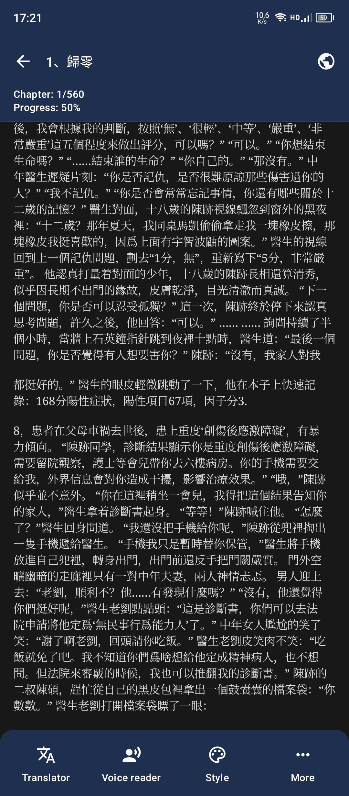

# Novela

Android-приложение для чтения веб-новелл. Приложение ориентировано на простоту использования и максимальное погружение в процесс чтения. Поиск по большому каталогу контента, выбор понравившегося и наслаждение чтением.

> **Примечание**: Это любительский форк проекта [NovelDokusha](https://github.com/nanihadesuka/NovelDokusha), который больше не поддерживается активно. Данный форк содержит дополнительные улучшения и исправления. Любые улучшения приветствуются!

## Лицензия
Copyright © 2023, [nani](https://github.com/HnDK0), распространяется под лицензией [GPL-3](LICENSE) FOSS

## Особенности

- **Поддержка перевода Gemini** - Перевод в реальном времени с помощью искусственного интеллекта Google Gemini
- **Бесплатный перевод через Google API** - Live перевод от Google бесплатно
- **Несколько источников** для чтения новелл:
  - **Китайские источники**
    - 69书吧
    - Twkan
    - Ttkan
  - **Русские источники**
    - Jaomix
    - RanobeLib
    - RanobeHub
    - Свободный Мир Ранобэ
    - BookHamster
  - **Англоязычные источники**
    - FreeWebNovel
    - NovelFull
    - NovelBin
    - Royal Road
    - Scribble Hub
    - AllNovel
    - BacaLightnovel
    - NoBadNovel
    - NovelBuddy
    - NovelFire
    - NovelHall
    - Novelku
    - NovLove
    - ReadNovelFull
    - WuxiaWorld
  - **Локальный источник** для чтения локальных EPUB-файлов
- **Несколько баз данных** для поиска новелл
- **Добавление новел по ссылке** - Возможность добавлять новеллы в библиотеку напрямую по URL-адресу
- **Простое резервное копирование и восстановление**
- **Светлая и темная темы**
- Следует современным рекомендациям **Material 3**
- **Расширенные возможности чтения**:
  - Бесконечная прокрутка
  - Пользовательский шрифт и размер текста
  - **Live перевод** с помощью Gemini AI или Google API
  - **Озвучка текста**:
    - Воспроизведение в фоновом режиме
    - Настройка голоса, высоты тона, скорости
    - Сохранение предпочтительных голосов
- **Автоматический обход Cloudflare** - Беспрепятственный доступ к защищенным источникам

## Скриншоты

| Библиотека | Источники |
|:----------:|:-----:|
|  |  |
| Книга | Глава |
|  |  |
| Настройки главы | Перевод главы |
|  |  |
| Озвучка главы | Добавление по URL |
|  |  |
| Глобальный поиск | Настройки |
|  |  |
| Обход CloudFlare | |
|  | |

## Технологический стек
- Kotlin
- XML views
- Jetpack Compose
- Material 3
- Coroutines
- LiveData
- Room (SQLite) для хранения данных
- Jsoup
- OkHttp
- Coil, Glide
- Gson, Moshi
- Google MLKit для перевода
- Android TTS
- Android media (управление уведомлениями воспроизведения TTS)