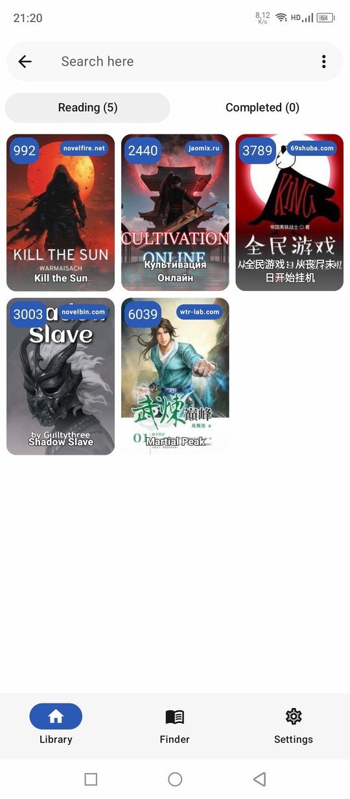
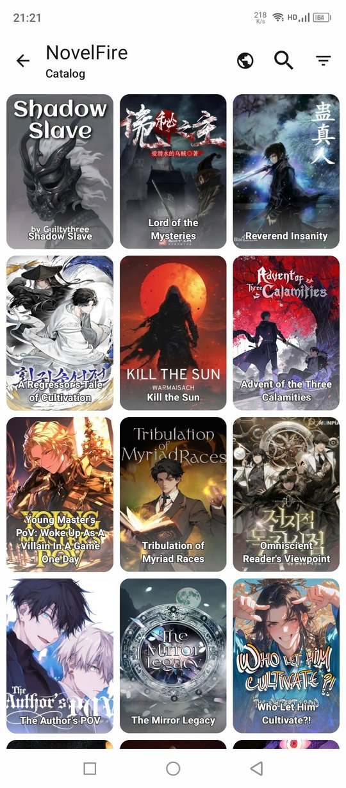
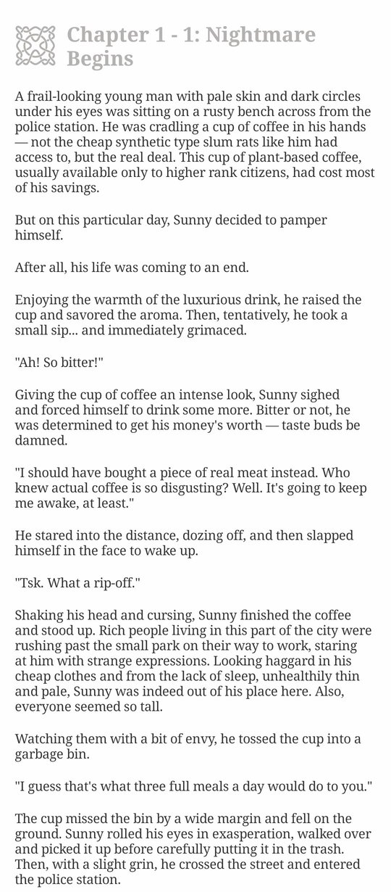
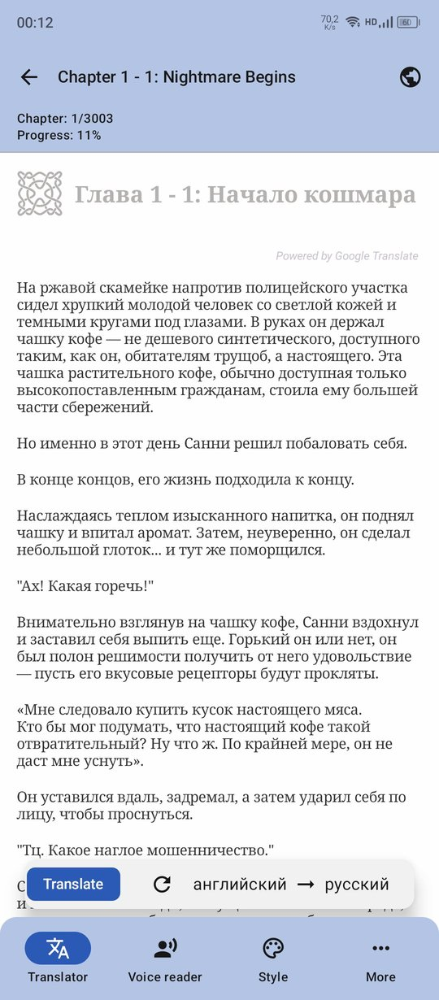
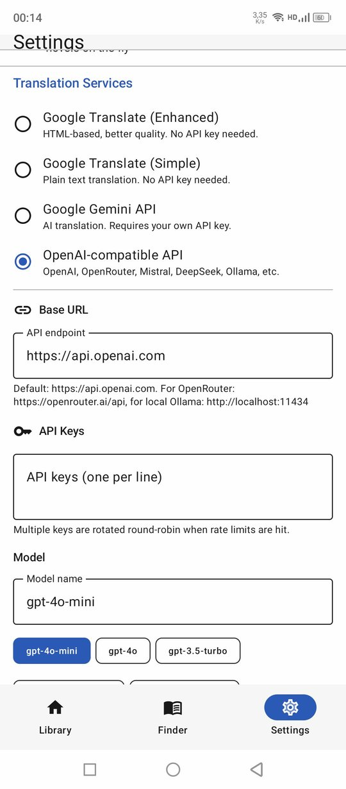
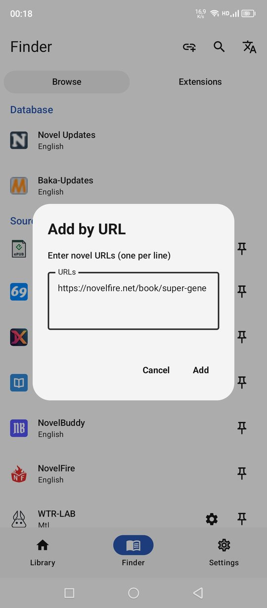
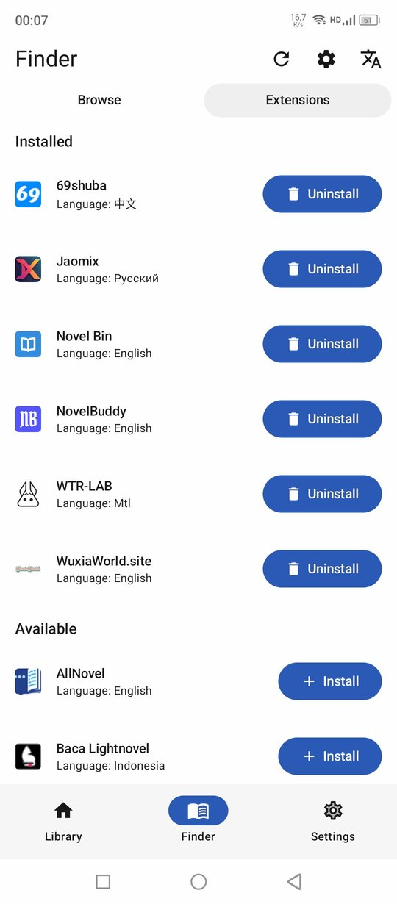

<!--
  SEO keywords: android novel reader, web novel app, light novel reader android,
  ranobe reader, epub reader android, translate novels online, novelfire,
  jaomix, royal road, scribble hub, wuxiaworld, free novel reader, open source novel app
-->

<div align="center">


# NoveLA

### Free, open-source Android reader for web novels, light novels, ranobe & EPUB

**25+ sources &nbsp;·&nbsp; Built-in translator &nbsp;·&nbsp; Text-to-speech &nbsp;·&nbsp; Offline reading &nbsp;·&nbsp; Material 3**

<br/>

[](https://github.com/HnDK0/NoveLA/releases/latest)
&nbsp;
[](https://github.com/HnDK0/NoveLA/releases)
&nbsp;
[](https://github.com/HnDK0/NoveLA/stargazers)
&nbsp;
[](LICENSE)
&nbsp;
[](https://github.com/HnDK0/NoveLA/releases/latest)

<br/>


<br/><br/>

> 🌍 **Language / Язык:** &nbsp; **🇬🇧 English** &nbsp;|&nbsp; [🇷🇺 Русский](README_RU.md)

<br/>

[📥 Download APK](#-download) &nbsp;·&nbsp; [✨ Features](#-features) &nbsp;·&nbsp; [📚 Sources](#-sources-25) &nbsp;·&nbsp; [🖼 Screenshots](#-screenshots) &nbsp;·&nbsp; [🤝 Contributing](#-contributing)

</div>

---

## About

NoveLA is a free Android app for reading web novels, light novels, ranobe, and EPUB files. It combines a powerful multi-source reader with a built-in translator — open any chapter and translate in one tap, without switching apps.

No subscriptions. No ads. Fully open source under GPL-3.0.

---

## ✨ Features

<table>
<tr>
<td valign="top" width="50%">

**Reader**
- Infinite chapter scrolling
- Custom fonts and text size
- Light & dark themes (Material 3)
- Offline chapter caching
- Clean immersive reading mode

**Text-to-Speech**
- Background playback
- Voice, speed, and pitch control

</td>
<td valign="top" width="50%">

**Discovery**
- 25+ built-in sources across EN, RU, ZH, ID, MTL
- Global multi-source search
- Add any novel by URL
- Filter by genre, rating, status
- Community plugin repository (Lua-based)

**Advanced**
- Backup & restore
- Regex text cleanup (strip ads & junk)
- Automatic Cloudflare Turnstile bypass
- Local EPUB library

</td>
</tr>
</table>

---

## 🌐 Built-in Translator

Translate chapters while reading — no copy-paste, no app switching. Four backends supported:

| Service | Cost | API Key | Notes |
|---------|------|---------|-------|
| Google Translate (Enhanced) | Free | Not required | HTML-based, better quality |
| Google Translate (Simple) | Free | Not required | Plain text, fast |
| Google Gemini API | Free tier | Required | AI translation, high quality |
| OpenAI-compatible API | Varies | Required | OpenAI, OpenRouter, DeepSeek, Ollama, Mistral… |

> Multiple API keys are rotated round-robin when rate limits are hit.

---

## 📚 Sources (25+)

<details>
<summary>Show full source list</summary>

| Language | Sources |
|----------|---------|
| English | FreeWebNovel · NovelFull · NovelBin · Royal Road · Scribble Hub · AllNovel · NoBadNovel · NovelBuddy · NovelFire · NovelHall · NovLove · ReadNovelFull · WuxiaWorld |
| Russian | Jaomix · RanobeLib · RanobeHub · Свободный Мир Ранобэ · BookHamster |
| Chinese | 69书吧 · Twkan · Ttkan · Novel543 · Quanben5 · Piaotia |
| Indonesian | BacaLightnovel |
| MTL | WTR-LAB |
| Local | EPUB files |

</details>

**Plus:** global multi-source search · add any novel by URL · community plugin repository

### Plugin Repository

NoveLA supports Lua-based external plugin repos — community-maintained sources installable directly from the app.

Official repo: [`HnDK0/external-sources`](https://github.com/HnDK0/external-sources)

To add: **Finder → Extensions → Settings (gear icon)** → paste the repo URL.

---

## 🖼 Screenshots

<div align="center">
<table>
  <tr>
    <td align="center"><b>Library</b><br/></td>
    <td align="center"><b>Catalog</b><br/></td>
    <td align="center"><b>Book Info</b><br/></td>
    <td align="center"><b>Chapter</b><br/></td>
  </tr>
  <tr>
    <td align="center"><b>Translation</b><br/></td>
    <td align="center"><b>Translate Settings</b><br/></td>
    <td align="center"><b>Add by URL</b><br/></td>
    <td align="center"><b>Plugins</b><br/></td>
  </tr>
</table>
</div>

---

## 📥 Download

**[Get the latest APK →](https://github.com/HnDK0/NoveLA/releases/latest)**

Or build from source:

```bash
git clone https://github.com/HnDK0/NoveLA
# Open in Android Studio and run on a device or emulator
```

Requires Android 8.0+.

---

## 🛠 Tech Stack

Kotlin · Coroutines · LiveData · Jetpack Compose · Material 3 · Room (SQLite) · Jsoup · OkHttp · Coil · Glide · Android TTS & Media APIs · Google MLKit · LuaJ

---

## 🤝 Contributing

Contributions are welcome:

- Fix or improve existing source parsers
- Add new sources via the [plugin repo](https://github.com/HnDK0/external-sources)
- Improve the reader UI or performance
- Report bugs via [Issues](https://github.com/HnDK0/NoveLA/issues)

---

## 📄 License

[GPL-3.0](LICENSE) — free to use, modify, and distribute under the same terms.

---

<div align="center">

**[Download](https://github.com/HnDK0/NoveLA/releases/latest) &nbsp;·&nbsp; [Issues](https://github.com/HnDK0/NoveLA/issues) &nbsp;·&nbsp; [Plugin Repo](https://github.com/HnDK0/external-sources)**

</div>
