#  NoveLA

<p align="center">
  <a href="https://github.com/HnDK0/NoveLA/releases/latest"></a>
  <a href="https://github.com/HnDK0/NoveLA/releases"></a>
  <a href="https://github.com/HnDK0/NoveLA/stargazers"></a>
  <a href="LICENSE"></a>
  
</p>

<p align="center">
  <b>Open-source Android novel reader • 25+ sources • Built-in translator • TTS • EPUB support</b>
</p>

---

## 🌍 Languages

<details open>
<summary>🇬🇧 English</summary>

## 📖 About

**NoveLA** is a free, open-source Android app for reading web novels, light novels, ranobe, and EPUB files — with a built-in translator, text-to-speech, and support for 25+ sources across multiple languages.

Designed for readers who want to enjoy foreign content without switching apps: find a novel, open a chapter, translate in one tap.

- 📚 25+ built-in sources + community plugin repository
- 🌐 Built-in Google & Gemini translator
- 🔊 Text-to-speech with background playback
- 📄 Local EPUB library support
- ☁️ Offline chapter caching
- 🎨 Material 3 UI, light & dark themes

---

## 📥 Download

Get the latest APK from [**Releases →**](https://github.com/HnDK0/NoveLA/releases/latest)

Or build from source:
```bash
git clone https://github.com/HnDK0/NoveLA
```
Open in Android Studio and run on a device or emulator.

---

## ✨ Features

### 🌐 Built-in Translator
- Translate chapters directly while reading — no copy-paste needed
- Free translation via Google Translate API
- Optional Gemini AI integration for higher-quality output
- Instant language switching without reloading the chapter

> **Note:** Free Gemini API keys are rate-limited. Limits depend on model and Google's quota policy.

---

### 🧩 Plugin Repository (External Sources)

NoveLA supports Lua-based external plugin repositories — community-maintained sources installable directly from the app.

**Official plugin repo:** [`HnDK0/external-sources`](https://github.com/HnDK0/external-sources)

To add: go to **Finder → Extensions → ⚙️ Settings** and paste the repository URL.

---

### 📚 Sources (25+)

<details>
<summary>Show full source list</summary>

#### 🇨🇳 Chinese
- 69书吧 · Twkan · Ttkan · Novel543 · Quanben5 · Piaotia

#### 🇷🇺 Russian
- Jaomix · RanobeLib · RanobeHub · Свободный Мир Ранобэ · BookHamster

#### 🇬🇧 English
- FreeWebNovel · NovelFull · NovelBin · Royal Road · Scribble Hub
- AllNovel · NoBadNovel · NovelBuddy · NovelFire · NovelHall
- NovLove · ReadNovelFull · WuxiaWorld

#### 🇮🇩 Indonesian
- BacaLightnovel

#### 🌐 MTL
- WTR-LAB

#### 📄 Local
- EPUB files

**Plus:** add any novel by URL · global multi-source search

</details>

---

### 📖 Reader
- Infinite chapter scrolling
- Custom fonts and text size
- Light & dark themes (Material 3)
- Offline chapter caching
- Clean immersive reading mode

### 🔊 Text-to-Speech
- Background playback
- Voice, speed, and pitch control

### 🛠 Advanced
- Automatic Cloudflare Turnstile bypass
- Regex-based text cleanup (strip ads & junk)
- Local library and reading history
- Backup and restore

---

## 🖼 Screenshots

<details open>
<summary>Show screenshots</summary>
<table>
  <tr>
    <td align="center"><b>Library</b><br>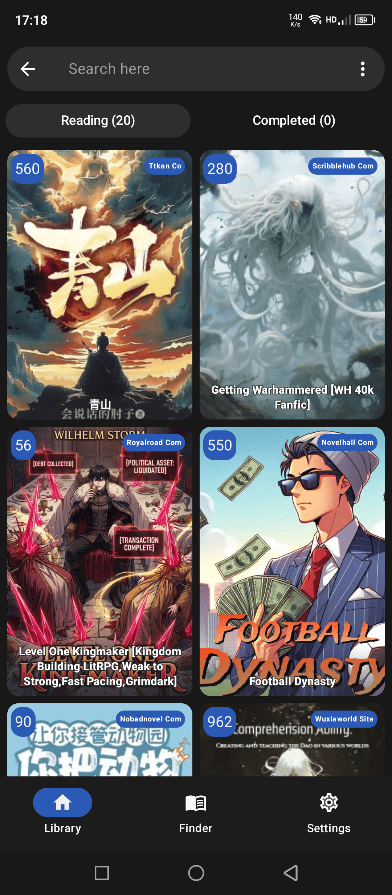</td>
    <td align="center"><b>Sources</b><br>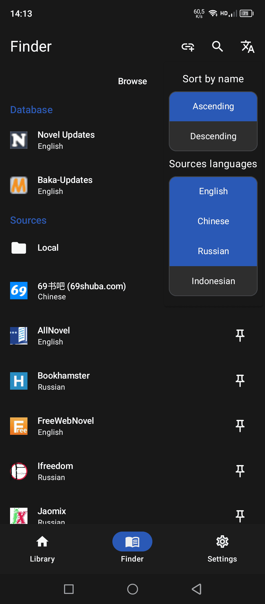</td>
    <td align="center"><b>Extensions</b><br>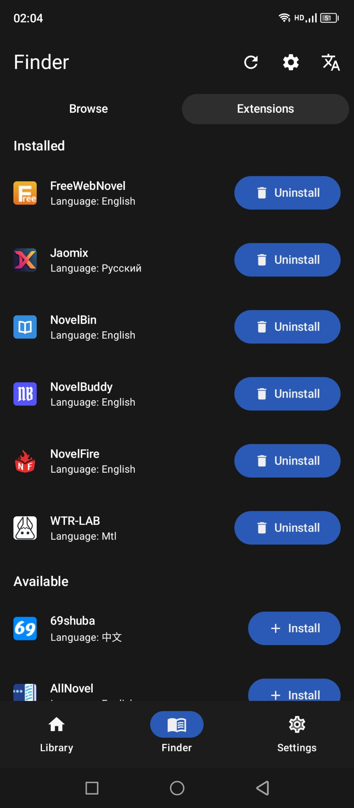</td>
  </tr>
  <tr>
    <td align="center"><b>Book</b><br>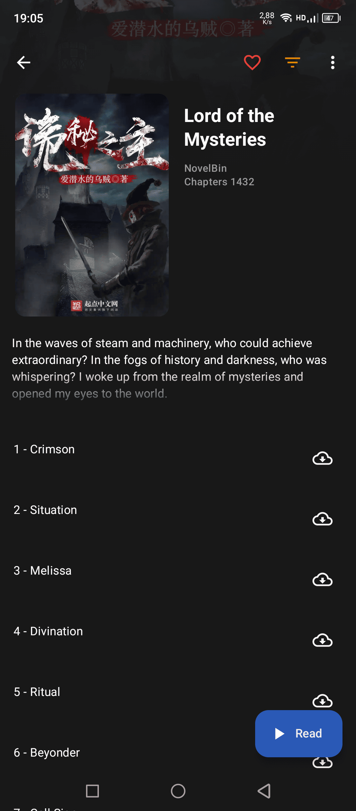</td>
    <td align="center"><b>Chapter</b><br></td>
    <td align="center"><b>Translation</b><br>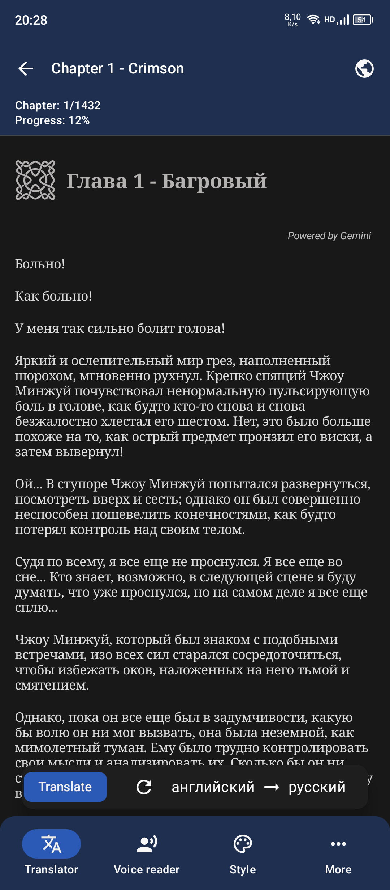</td>
  </tr>
  <tr>
    <td align="center"><b>Voice</b><br>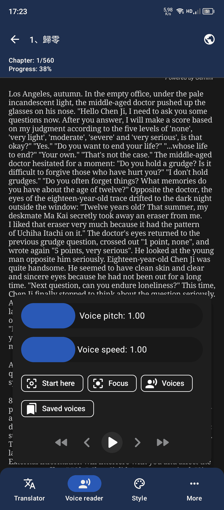</td>
    <td align="center"><b>Add by URL</b><br>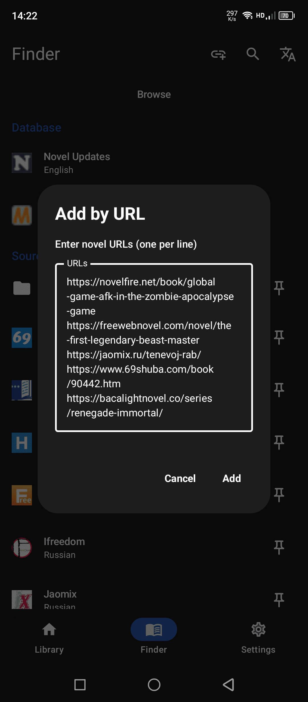</td>
    <td align="center"><b>Global Search</b><br>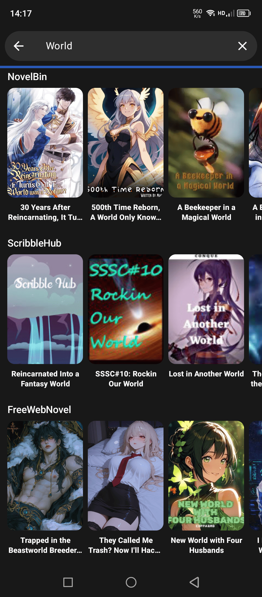</td>
  </tr>
  <tr>
    <td align="center"><b>Settings</b><br>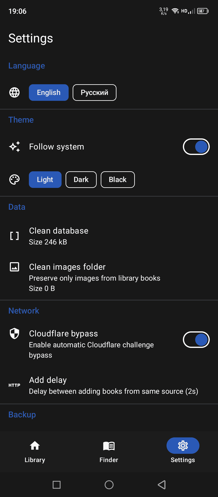</td>
    <td align="center"><b>Cloudflare Bypass</b><br>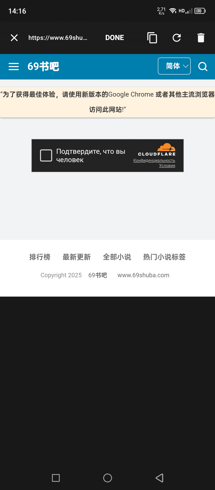</td>
    <td align="center"><b>Regex settings</b><br>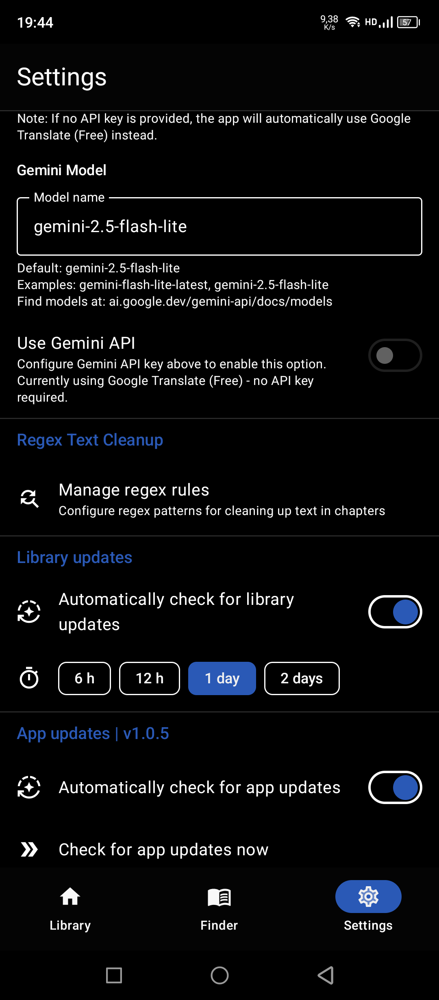</td>
  </tr>
  <tr>
    <td align="center"><b>Regex cleanup</b><br>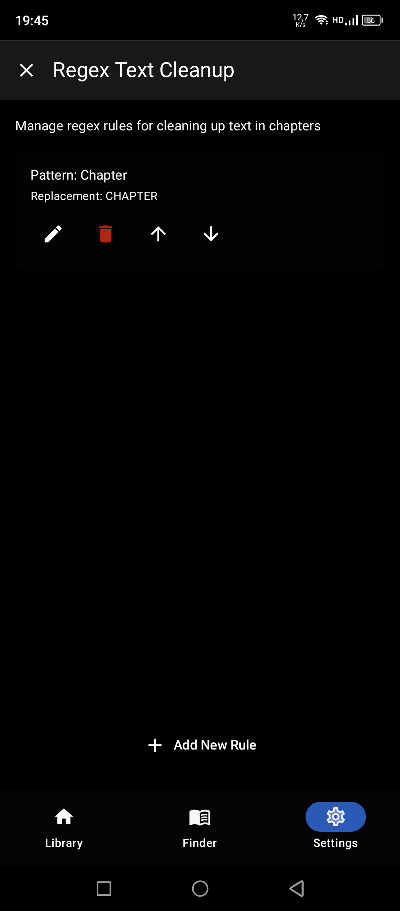</td>
    <td align="center"><b>WTR-LAB language</b><br>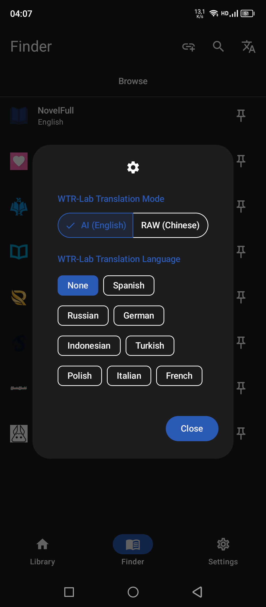</td>
    <td align="center"><b>WTR-LAB settings</b><br>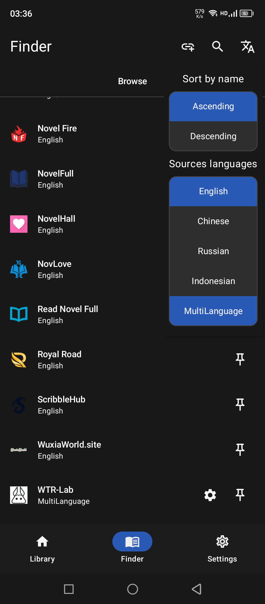</td>
  </tr>
</table>
</details>

---

## 🧩 Tech Stack
- Kotlin, Coroutines, LiveData
- Jetpack Compose + XML Views
- Material 3
- Room (SQLite), Jsoup, OkHttp
- Coil, Glide
- Android TTS & Media APIs
- Google MLKit
- LuaJ (plugin engine)

---

## 🤝 Contributing

Contributions are welcome! Feel free to:
- Fix or improve existing source parsers
- Add new sources via the [external plugin repo](https://github.com/HnDK0/external-sources)
- Improve the reader UI or performance
- Report bugs via [Issues](https://github.com/HnDK0/NoveLA/issues)

---

## 📜 License
[GPL-3.0](LICENSE)

</details>

---

<details>
<summary>🇷🇺 Русский</summary>

## 📖 О приложении

**NoveLA** — бесплатный open source Android-ридер для веб-новелл, ранобэ и EPUB с встроенным переводчиком, озвучкой и поддержкой 25+ источников.

Создан для тех, кто читает иностранный контент: открываете главу и переводите прямо в ридере, без лишних приложений.

- 📚 25+ встроенных источников + репозиторий плагинов сообщества
- 🌐 Встроенный переводчик Google и Gemini
- 🔊 Озвучка (TTS) с фоновым воспроизведением
- 📄 Локальная EPUB-библиотека
- ☁️ Оффлайн кэширование глав
- 🎨 Material 3, светлая и тёмная темы

---

## 📥 Скачать

Последний APK — в разделе [**Releases →**](https://github.com/HnDK0/NoveLA/releases/latest)

Или собрать самостоятельно:
```bash
git clone https://github.com/HnDK0/NoveLA
```
Откройте в Android Studio и запустите на устройстве или эмуляторе.

---

## ✨ Возможности

### 🌐 Встроенный переводчик
- Перевод прямо во время чтения — без копирования
- Бесплатный перевод через Google API
- Опциональный Gemini для более качественного перевода
- Мгновенное переключение языка без перезагрузки главы

> **Примечание:** бесплатные ключи Gemini API имеют ограничения по запросам и скорости.

---

### 🧩 Репозиторий плагинов

NoveLA поддерживает внешние Lua-плагины — источники от сообщества, устанавливаемые прямо из приложения.

**Официальный репозиторий:** [`HnDK0/external-sources`](https://github.com/HnDK0/external-sources)

Подключить: **Finder → Extensions → ⚙️ Настройки** → вставьте URL репозитория.

---

### 📚 Источники (25+)

<details>
<summary>Показать полный список</summary>

#### 🇨🇳 Китайские
- 69书吧 · Twkan · Ttkan · Novel543 · Quanben5 · Piaotia

#### 🇷🇺 Русские
- Jaomix · RanobeLib · RanobeHub · Свободный Мир Ранобэ · BookHamster

#### 🇬🇧 Английские
- FreeWebNovel · NovelFull · NovelBin · Royal Road · Scribble Hub
- AllNovel · NoBadNovel · NovelBuddy · NovelFire · NovelHall
- NovLove · ReadNovelFull · WuxiaWorld

#### 🇮🇩 Индонезийские
- BacaLightnovel

#### 🌐 MTL
- WTR-LAB

#### 📄 Локальные
- EPUB файлы

**Дополнительно:** добавление новелл по ссылке · глобальный поиск по всем источникам

</details>

---

### 📖 Ридер
- Бесконечная прокрутка глав
- Настройка шрифта и размера текста
- Светлая и тёмная темы (Material 3)
- Оффлайн кэширование
- Чистый режим чтения

### 🔊 Озвучка (TTS)
- Фоновое воспроизведение
- Настройка голоса, скорости и высоты тона

### 🛠 Продвинутые функции
- Автоматический обход Cloudflare Turnstile
- Очистка текста через Regex (удаление рекламы)
- Локальная библиотека и история чтения
- Резервное копирование и восстановление

---

## 🖼 Скриншоты

<details>
<summary>Показать скриншоты</summary>
<table>
  <tr>
    <td align="center"><b>Library</b><br></td>
    <td align="center"><b>Sources</b><br></td>
    <td align="center"><b>Extensions</b><br></td>
  </tr>
  <tr>
    <td align="center"><b>Book</b><br></td>
    <td align="center"><b>Chapter</b><br></td>
    <td align="center"><b>Translation</b><br></td>
  </tr>
  <tr>
    <td align="center"><b>Voice</b><br></td>
    <td align="center"><b>Add by URL</b><br></td>
    <td align="center"><b>Global Search</b><br></td>
  </tr>
  <tr>
    <td align="center"><b>Settings</b><br></td>
    <td align="center"><b>Cloudflare Bypass</b><br></td>
    <td align="center"><b>Regex settings</b><br></td>
  </tr>
  <tr>
    <td align="center"><b>Regex cleanup</b><br></td>
    <td align="center"><b>WTR-LAB language</b><br></td>
    <td align="center"><b>WTR-LAB settings</b><br></td>
  </tr>
</table>
</details>

---

## 🧩 Технологии
- Kotlin, Coroutines, LiveData
- Jetpack Compose + XML Views
- Material 3
- Room (SQLite), Jsoup, OkHttp
- Coil, Glide
- Android TTS & Media APIs
- Google MLKit
- LuaJ (движок плагинов)

---

## 🤝 Контрибьютинг

Приветствуются:
- Исправления парсеров существующих источников
- Новые источники через [репозиторий плагинов](https://github.com/HnDK0/external-sources)
- Улучшения ридера или производительности
- Баг-репорты через [Issues](https://github.com/HnDK0/NoveLA/issues)

---

## 📄 Лицензия
[GPL-3.0](LICENSE)

</details>
