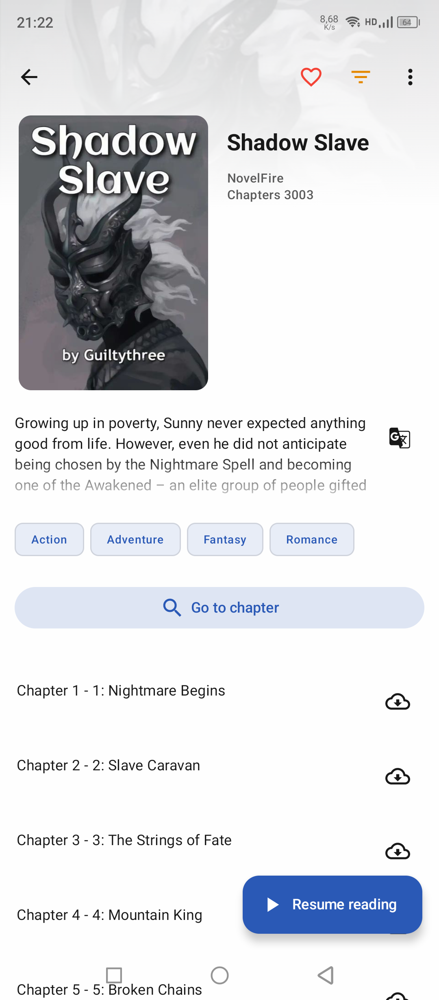

# NovelDokusha
Android web novel reader. Reader focused on simplicity, improving reading immersion.
Search from a large catalog of content, open your pick and just enjoy.

> **Note**: My fork is just for myself. Actively maintained fork by [@Nabeelshar](https://github.com/Nabeelshar). The [original repository](https://github.com/nanihadesuka/NovelDokusha) is no longer actively maintained.

# License
Copyright © 2023, [nani](https://github.com/nanihadesuka), Released under [GPL-3](LICENSE) FOSS

## Features
  - **Gemini Translation Support** - Live translation powered by Google Gemini AI
  - **Free Google Api Translation** - Live Google translation FREE
  - **Multiple sources** from where to read -novels:
    - **Chinese Sources** (with GBK encoding support):
      - 69书吧 (69shuba.com) - With automatic Cloudflare bypass
      - UU看书 (uukanshu.net)
      - 顶点小说 (ddxss.cc)
      - 乐阅读 (27k.net)
      - Twkan (twkan.com)
    - **Russian Sources**
      - Jaomix (jaomix.ru)
      - RanobeLib (ranobelib.me)
      - RanobeHub (ranobehub.org)
      - Свободный Мир Ранобэ (ifreedom.su)
      - BookHamster (bookhamster.ru)
    - Additional English and international sources
  - **Multiple databases** to search for novels
  - **Local source** to read local EPUBs
  - **Easy backup and restore**
  - **Light and dark themes**
  - Follows modern **Material 3** guidelines
  - **Advanced Reader Features**:
    - Infinite scroll
    - Custom font, font size
    - **Live translation** with Gemini AI
    - **Text to speech**:
      - Background playback
      - Adjust voice, pitch, speed
      - Save your preferred voices
  - **Automatic Cloudflare bypass** - Seamless access to protected sources

  
## Screenshots
 
|              Library               |                Finder                |
|:----------------------------------:|:------------------------------------:|
|        |           |
|             Book info              |            Book chapters             |
|      |     |
|               Reader               |           Database search            |
|         |  |
|           Global search            |                                      |
|  |                                      |

## Tech stack
  - Kotlin
  - XML views
  - Jetpack compose
  - Material 3
  - Coroutines
  - LiveData
  - Room (SQLite) for storage
  - Jsoup
  - Okhttp
  - Coil, glide
  - Gson, Moshi
  - Google MLKit for translation
  - Android TTS
  - Android media (TTS playback notification controls)
